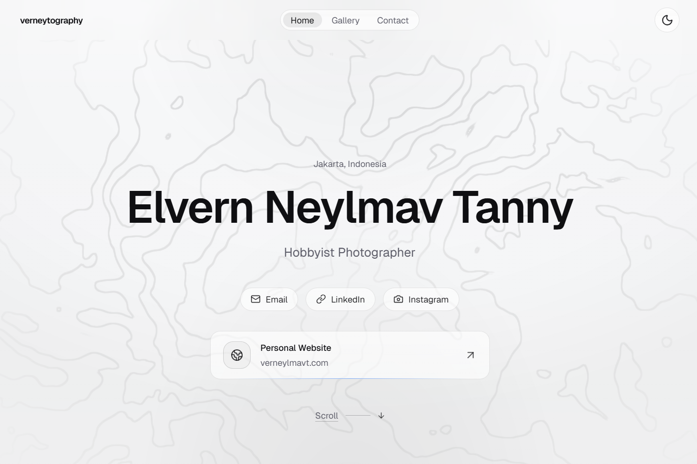
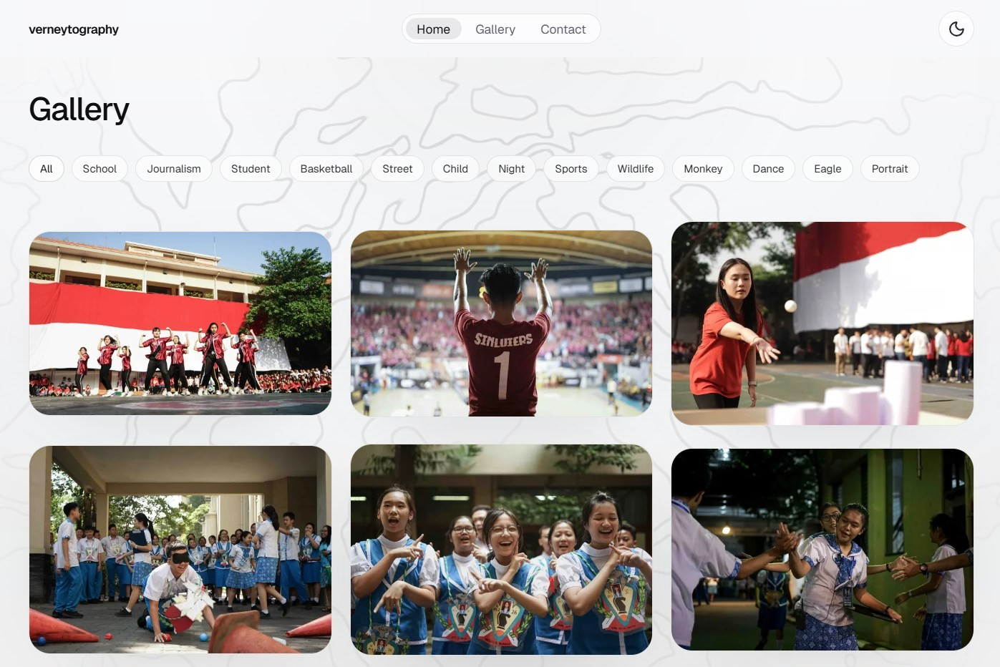
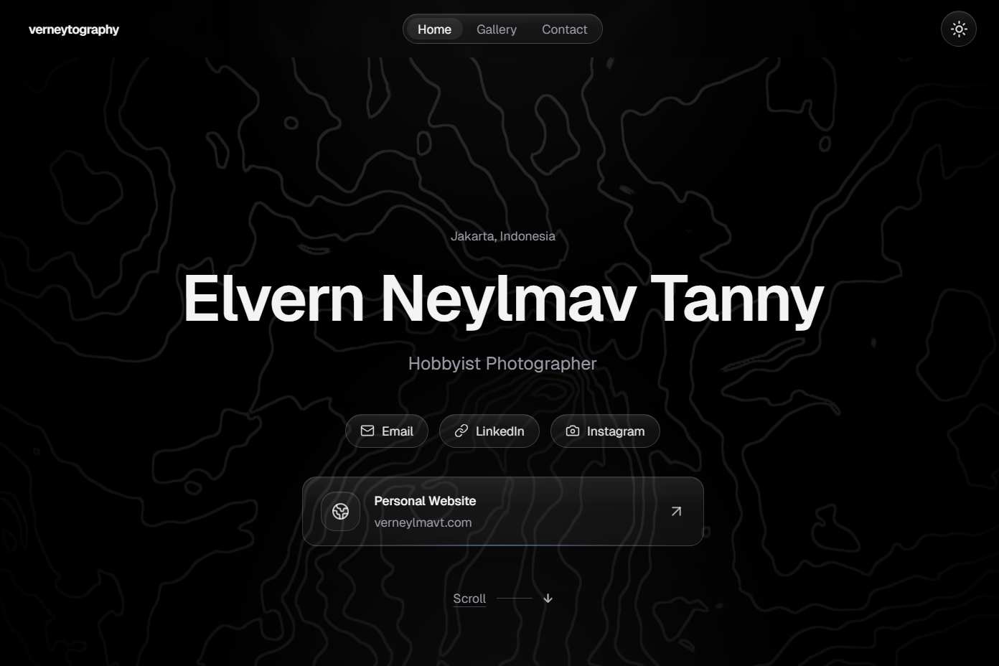
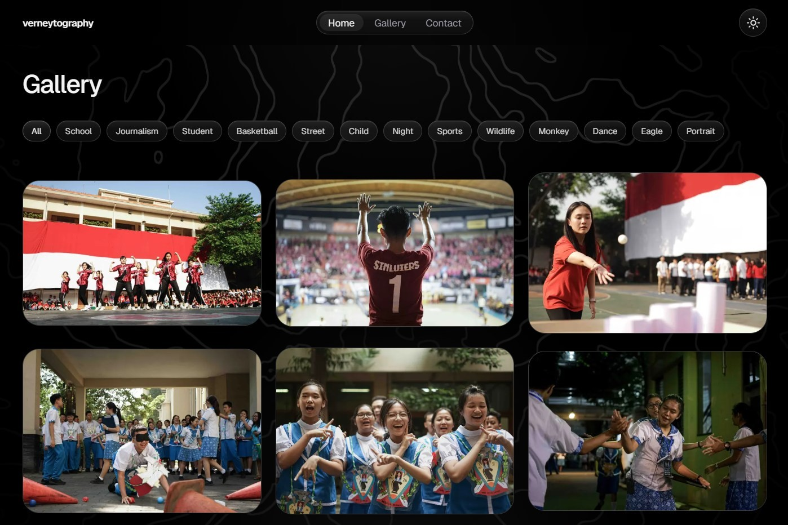

# verneytography.vercel.app (v1)

1st iteration of verneytography.vercel.app.

This project represents the first iteration of my photography portfolio website, designed to showcase visual work through a clean, immersive, and modern web experience. Built using Next.js (App Router) with Tailwind CSS, the site focuses on minimalism, fluid interaction, and strong visual hierarchy—allowing the photography itself to remain the central focus.

From a design and engineering standpoint, this version emphasizes aesthetic clarity, responsiveness, and performance. It integrates a custom theming system with light/dark mode support, advanced UI treatments such as glassmorphism, and animated WebGL-based backgrounds to enhance depth without distracting from content. The architecture is component-driven, enabling modularity and scalability for future iterations.

This iteration serves as a foundation for evolving the portfolio into a more feature-rich platform, potentially incorporating dynamic content management, backend integration, and richer interaction patterns.

## Tech Stack

- Next.js
- Tailwind CSS
- Three.js
- WebGL

## Galleries







## Run

### Requirements

- Git
- Browser
- Node.js >= 20.9.0
- npm

### Clone

```bash
git clone https://github.com/verneylmavt/verneytography.vercel.app.git
cd verneytography.vercel.app
git checkout v1
```

### Install

```bash
npm install
```

### Local Run

```bash
npm run dev
```

Open: `http://localhost:3000`.

## Customize

- Site Content
    - Name + Tagline + Contact Links: `src/content/site.ts`
    - Gallery Images: `src/content/photos.json`
    - Ordering Logic: `src/content/photo-order.ts`
- UI Components
    - `src/components/hero-section.tsx`
    - `src/components/gallery/**`
    - `src/components/contact-section.tsx`
    - `src/components/header.tsx`
- Styling & Theme
    - Theme Tokens + Glass Effects + Animations: `src/app/globals.css`
- Background Effects
    - `src/components/hero-topographic-background.tsx`
    - `src/components/hero-sandstorm-background.tsx`

## Project Structure

```text
src/
    app/
        globals.css          # Global styles, theme tokens, glass UI
        layout.tsx           # Root layout, fonts, theme initialization
        page.tsx             # Homepage composition

    components/
        header.tsx           # Navigation bar
        hero-section.tsx     # Landing section
        contact-section.tsx  # Contact links
        gallery/             # Gallery components
        hero-topographic-background.tsx
        hero-sandstorm-background.tsx

    content/
        site.ts              # Site metadata
        photos.json          # Image data
        photo-order.ts       # Ordering logic

    public/
        demo_*.png           # README screenshots
```
